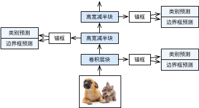

# 单发多框检测：SSD

我们将介绍的第一个模型是单发多框检测（single shot multibox detection，简称SSD）[1]。它并不是第一个提出来的基于深度学习的物体检测模型，也不是精度最高的，但因为其简单性而被大量使用。我们将使用SSD来详解目标检测的实现细节。

```{.python .input  n=1}
%matplotlib inline
import sys
sys.path.insert(0, '..')
import time
import gluonbook as gb
from mxnet import gluon, image, nd, contrib, init, autograd
from mxnet.gluon import nn
```

## SSD 模型

SSD模型的示意图如下。给定输入图片，其首先使用主要由卷积层组成的模块来进行特征抽取。在其输出上，我们以每个像素为中心构建多个锚框（往左的箭头），然后使用softmax来对每个锚框判断其包含的物体类别，以及预测它到真实物体边界框的距离。卷积层的输出同时被输入到一个高宽减半模块（往上的箭头）来缩小图片尺寸。这个模块的输入将进入到另一个卷积模块抽取特征，和构建锚框来预测物体类别和边界框。这样设计的目的是在不同的尺寸上进行目标检测，例如之前的锚框主要检测图片中尺寸较小的物体，而这里我们则检测尺寸稍大的物体。自然的，我们会重复这一过程多次来在多种不同的尺寸下检测物体。



接下来我们介绍并实现图中各个模块。首先注意到这里锚框是由上小节介绍的方法生产而来。接下来介绍类别预测和边界框预测。

### 类别预测

假设数据集中有$n$种不同的物体，那么我们将对每个锚框做$n+1$类分类，其中类0表示锚框只包含背景。因为我们对输入像素为中心生产多个锚框，记为$a$，我们将会预测$hwa$个锚框的分类结果，这里$h$和$w$分别是输入高和宽。如果使用正常的全连接层作为输出，可能会导致有过多的模型参数。回忆[“网络中的网络：NiN”](../chapter_convolutional-neural-networks/nin.md)这一节里我们介绍了使用卷基层的通道来输出类别预测，SSD采用同样的方法来降低模型复杂度。

具体来说，类别预测层使用一个保持输入高宽的卷基层，其输出的$(x,y)$像素通道里包含了以输入$(x,y)$像素为中心的所有锚框的类别预测。其输出通道数为$a(n+1)$，其中通道$i(n+1)$是第$i$个锚框只含有背景的置信度，而通道$i(n+1)+j+1$则是第$i$锚框含有第$j$类物体的置信度。

下面我们定义一个这样的类别分类器，指定$a$和$n$后，它使用一个填充为1的3乘3卷积层。注意到我们使用了固定的卷积窗口，它可能不能覆盖锚框定义的区域。所以我们需要前面的卷积层能有效的将较大的能覆盖锚框的区域的特征浓缩到一个3乘3窗口里。

```{.python .input  n=2}
def cls_predictor(num_anchors, num_classes):
    return nn.Conv2D(num_anchors * (num_classes+1), kernel_size=3, padding=1)
```

### 边界框预测

对每个锚框我们需要预测如何将其变换到真实的物体边界框。变换由一个长为4的向量来描述，表示左下和右上的x、y轴坐标偏移。我们同样使用一个保持高宽的卷积层来输出偏移预测，它有$4a$个输出通道，对于第$i$个锚框，它的偏移预测在$4i$到$4i+3$这4个通道里。

```{.python .input  n=3}
def bbox_predictor(num_anchors):
    return nn.Conv2D(num_anchors * 4, kernel_size=3, padding=1)
```

### 合并多层的预测输出

SSD中会在多个尺度上进行预测。由于每个尺度上的输入高宽和锚框的选取不一样，导致其形状各不一样。下面例子中我们构造两个尺度的输入，其中第二个将第一个的高宽减半。然后构造两个类别预测层，其分别对每个输入像素构造5和3个锚框。

```{.python .input  n=4}
def forward(x, block):
    block.initialize()
    return block(x)

y1 = forward(nd.zeros((2, 8, 20, 20)), cls_predictor(5, 10))
y2 = forward(nd.zeros((2, 16, 10, 10)), cls_predictor(3, 10))
(y1.shape, y2.shape)
```

预测的输出格式为（批量大小，通道数，高，宽）。可以看到除了批量大小外，其他维度大小均不一样。我们需要将它们变形成统一的格式并将多尺度的输出合并起来，让后续的处理变得简单。

我们首先将通道，即预测结果，放到最后。因为不同尺度下批量大小保持不变，所以将结果转成二维的（批量大小，高$\times$宽$\times$通道数）格式，方便之后的拼接。

```{.python .input  n=5}
def flatten_pred(pred):
    return pred.transpose(axes=(0,2,3,1)).flatten()
```

拼接就是简单将在维度1上合并结果。

```{.python .input  n=6}
def concat_preds(preds):
    return nd.concat(*[flatten_pred(p) for p in preds], dim=1)
```

可以看到`y1`和`y2`形状不同。为了之后处理简单，我们将不同层的输入合并成一个输出。首先我们将通道移到最后的维度，然后将其展成2D数组。因为第一个维度是样本个数，所以不同输出之间是不变，我们可以将所有输出在第二个维度上拼接起来。

```{.python .input  n=7}
concat_preds([y1, y2]).shape
```

### 减半模块

减半模块将输入高宽减半来得到不同尺度的特征，这是通过步幅2的2乘2最大池化层来完成。我们前面提到因为预测层的宽口为3，所以我们需要额外卷积层来扩大其作用窗口来有效覆盖锚框区域。为此我们加入两个3乘3卷基层，每个后接批量归一化层和ReLU激活层。这样，一个尺度上的3乘3窗口覆盖了上一个尺度上的10乘10窗口。

```{.python .input  n=8}
def down_sample_blk(num_filters):
    blk = nn.HybridSequential()
    for _ in range(2):
        blk.add(nn.Conv2D(num_filters, kernel_size=3, padding=1),
                nn.BatchNorm(in_channels=num_filters),
                nn.Activation('relu'))
    blk.add(nn.MaxPool2D(2))
    blk.hybridize()
    return blk
```

可以看到，它将改变了输入的通道数，并将高宽减半。

```{.python .input  n=9}
forward(nd.zeros((2, 3, 20, 20)), down_sample_blk(10)).shape
```

### 主体网络

主体网络用来从原始像素抽取特征，通常使用常用的深度卷积神经网络。例如[1]中使用了VGG，之后的工作大家也常用ResNet。本小节为了计算简单性，我们构造一个小的主体网络。其叠加三个减半模块，输出通道数从16开始每个模块对其翻倍。

```{.python .input  n=10}
def body_blk():
    blk = nn.HybridSequential()
    for num_filters in [16, 32, 64]:
        blk.add(down_sample_blk(num_filters))
    return blk

forward(nd.zeros((2, 3, 256, 256)), body_blk()).shape
```

### 完整的模型

我们已经介绍了SSD模型中的各个模块，现在我们将构建整个模型。这个模型有五个模块，每个模块对输入进行特征抽取，并且预测锚框的类和偏移。第一个模块使用主体网络，第二到四模块使用减半模块，最后一个模块则使用全局的最大池化层来将高宽降到1。下面函数定义如何如何构建这些模块。

```{.python .input  n=11}
def get_blk(i):
    if i == 0:
        blk = body_blk()
    elif i == 4:
        blk = nn.GlobalMaxPool2D()
    else:
        blk = down_sample_blk(128)
    return blk
```

接下来定义每个模块如何进行前向计算。它跟之前的卷积神经网络不同在于，我们不仅输出卷积块的输出，而且我们还返回在输出上生产的锚框，以及每个锚框的类别预测和偏移预测。

```{.python .input  n=12}
def single_scale_forward(x, blk, size, ratio, cls_predictor, bbox_predictor):
    y = blk(x)
    anchor = contrib.ndarray.MultiBoxPrior(y, sizes=size, ratios=ratio)
    cls_pred = cls_predictor(y)
    bbox_pred = bbox_predictor(y)
    return (y, anchor, cls_pred, bbox_pred)
```

对每个模块我们要定义其输出上的锚框如何生成。比例固定成1、2和0.5。但大小上则不通荣。

```{.python .input  n=13}
num_anchors = 4
sizes = [[.2, .272], [.37, .447], [.54, .619], [.71, .79], [.88, .961]]
ratios = [[1,2,.5]] * 5
```

完整的模型定义如下。

```{.python .input  n=14}
class TinySSD(gluon.Block):
    def __init__(self, num_classes, verbose=False, **kwargs):
        super(TinySSD, self).__init__(**kwargs)
        self.num_classes = num_classes
        for i in range(5):
            setattr(self, 'blk_%d'%i, get_blk(i))
            setattr(self, 'cls_%d'%i, cls_predictor(num_anchors, num_classes))
            setattr(self, 'bbox_%d'%i, bbox_predictor(num_anchors))

    def forward(self, x):
        anchors, cls_preds, bbox_preds = [None]*5, [None]*5, [None]*5
        for i in range(5):
            x, anchors[i], cls_preds[i], bbox_preds[i] = single_scale_forward(
                x, getattr(self, 'blk_%d'%i), sizes[i], ratios[i],
                getattr(self, 'cls_%d'%i), getattr(self, 'bbox_%d'%i))
        return (nd.concat(*anchors, dim=1),
                concat_preds(cls_preds).reshape((0, -1, self.num_classes+1)), #.transpose(axes=(0,2,1)),
                concat_preds(bbox_preds))

net = TinySSD(num_classes=2, verbose=True)
net.initialize()
x = nd.zeros((2,3,256,256))
anchors, cls_preds, bbox_preds = net(x)

print('Output achors:', anchors.shape)
print('Output class predictions:', cls_preds.shape)
print('Output box predictions:', bbox_preds.shape)
```

## 训练

### 读取数据和初始化训练

我们使用之前构造的皮卡丘数据集。

```{.python .input  n=15}
batch_size = 32
train_data, test_data = gb.load_data_pikachu(batch_size)
# GPU 实现里要求每张图片至少有三个边界框，我们加上两个标号为 -1 的边界框。
train_data.reshape(label_shape=(3, 5))
```

模型和训练器的初始化跟之前类似。

```{.python .input  n=16}
ctx = gb.try_gpu()
net = TinySSD(num_classes = 2)
net.initialize(init=init.Xavier(), ctx=ctx)
trainer = gluon.Trainer(net.collect_params(),
                        'sgd', {'learning_rate': 0.1, 'wd': 5e-4})
```

### 损失和评估函数

物体识别有两个损失函数，一是对每个锚框的类别预测，可以重用之前图片分类问题里一直使用的Softmax和交叉熵损失。二是正类锚框的偏移预测。它是一个回归问题，但我们这里不使用前面介绍过的L2损失函数，而是使用对误差较大的损失更小的L1损失函数，即$l_1(\hat y, y) = |\hat y - y|$。

```{.python .input  n=17}
cls_loss = gluon.loss.SoftmaxCrossEntropyLoss()
bbox_loss = gluon.loss.L1Loss()
```

```{.python .input  n=18}
def calc_loss(cls_preds, cls_labels, bbox_preds, bbox_labels, bbox_masks):
    cls = cls_loss(cls_preds, cls_labels)
    bbox = bbox_loss(bbox_preds * bbox_masks, bbox_labels * bbox_masks)
    return cls + bbox

```

对于分类好坏我们可以沿用之前的分类精度。因为使用了L1损失，我们评估边框预测的用平均绝对误差。

```{.python .input  n=21}
def cls_metric(cls_preds, cls_labels):
    # 注意这里类别预测结果放在最后一维，argmax的时候指定使用最后一维。
    return (cls_preds.argmax(axis=-1) == cls_labels).mean().asscalar()

def bbox_metric(bbox_preds, bbox_labels, bbox_masks):
    return (bbox_labels - bbox_preds * bbox_masks).abs().mean().asscalar()
```

### 训练模型

训练函数跟前面的不一样在于网络会有多个输出，而且有两个损失函数。为了代码简单起见我们没有评估测试数据集。

```{.python .input  n=22}
for epoch in range(20):
    acc, mae = 0, 0
    train_data.reset()  # 从头读取数据。
    tic = time.time()
    for i, batch in enumerate(train_data):
        # 复制数据到 GPU。
        X = batch.data[0].as_in_context(ctx)
        Y = batch.label[0].as_in_context(ctx)
        with autograd.record():
            # 对每个锚框预测输出。
            anchors, cls_preds, bbox_preds = net(X)
            # 对每个锚框生成标号。
            bbox_labels, bbox_masks, cls_labels = contrib.nd.MultiBoxTarget(
                anchors, Y, cls_preds.transpose(axes=(0,2,1)))
            # 计算类别预测和边界框预测损失。
            loss = calc_loss(cls_preds, cls_labels,
                             bbox_preds, bbox_labels, bbox_masks)
        # 计算梯度和更新模型。
        loss.backward()
        trainer.step(batch_size)
        # 更新类别预测和边界框预测评估。
        acc += cls_metric(cls_preds, cls_labels)
        mae += bbox_metric(bbox_preds, bbox_labels, bbox_masks)
    if (epoch+1) % 5 == 0:
        print('epoch %2d, class err %.2e, bbox mae %.2e, time %.1f sec' % (
            epoch+1, 1-acc/(i+1), mae/(i+1), time.time()-tic))
```

## 预测

在预测阶段，我们希望能把图片里面所有感兴趣的物体找出来。我们首先定义一个图片预处理函数，它对图片进行变现然后转成卷积层需要的四维格式。

```{.python .input  n=20}
def process_image(file_name):
    img = image.imread(file_name)
    data = image.imresize(img, 256, 256).astype('float32')
    return data.transpose((2,0,1)).expand_dims(axis=0), img

x, img = process_image('../img/pikachu.jpg')
```

在预测的时候，我们通过`MultiBoxDetection`函数来将合并预测偏移和锚框得到预测边界框，并使用NMS去除重复的预测边界框。

```{.python .input  n=33}
def predict(x):
    anchors, cls_preds, bbox_preds = net(x.as_in_context(ctx))
    cls_probs = cls_preds.softmax().transpose((0,2,1))
    out = contrib.nd.MultiBoxDetection(cls_probs, bbox_preds, anchors)
    idx = [i for i, row in enumerate(out[0]) if row[0].asscalar() != -1]
    return out[0, idx]

out = predict(x)
```

最后我们将预测出置信度超过某个阈值的边框画出来：

```{.python .input  n=34}
gb.plt.rcParams['figure.figsize'] = (6, 6)
def display(img, out, threshold=0.5):
    fig = gb.plt.imshow(img.asnumpy())
    for row in out:
        score = row[1].asscalar()
        if score < threshold:
            continue
        bbox = [row[2:6] * nd.array(img.shape[0:2]*2, ctx=row.context)]
        gb.show_bboxes(fig.axes, bbox, '%.2f'%score, 'w')

display(img, out, threshold=0.4)
```

## 小结

* SSD多尺度上对每个锚框预测类别与真实边界框的位移来进行物体检测。

## 练习

* 限于篇幅原因我们忽略了SSD实现的许多细节。我们选取其中数个作为练习。

### 损失函数

边界框预测时使用了$L_1$损失，但这个函数在0点处导数不唯一，因此可能会影响收敛。一个常用改进是在0点附近使用平方函数使得它更加平滑。它被称之为平滑$L_1$损失函数。它通过一个参数$\sigma$来控制平滑的区域：

$$
f(x) =
    \begin{cases}
    (\sigma x)^2/2,& \text{if }x < 1/\sigma^2\\
    |x|-0.5/\sigma^2,& \text{otherwise}
    \end{cases}
$$

当$\sigma$很大时它类似于$L_1$损失，变小则函数更加平滑。

```{.python .input  n=26}
sigmas = [10, 1, .5]
lines = ['-', '--', '-.']
x = nd.arange(-2, 2, 0.1)

gb.set_figsize((4,3))
for l,s in zip(lines, sigmas):
    y = nd.smooth_l1(x, scalar=s)
    gb.plt.plot(x.asnumpy(), y.asnumpy(), l, label='sigma=%.1f'%s)
gb.plt.legend();
```

对于类别预测我们使用了交叉熵损失。假设对真实类别$j$的概率预测是$p_j$，交叉熵损失为$\log(p_j)$。我们可以使用一个称之为关注损失（focal loss）的函数来对之稍微变形。给定正的$\gamma$和$\alpha$，它的定义是

$$ - \alpha (1-p_j)^{\gamma} \log(p_j) $$

可以看到，增加$\gamma$可以使得对正类预测值比较大时损失变小。

```{.python .input}
def focal_loss(gamma, x):
    return - (1-x)**gamma*x.log()

x = nd.arange(0.01, 1, .01)
for l, gamma in zip(lines, [0,1,5]):
    y = gb.plt.plot(x.asnumpy(), focal_loss(gamma, x).asnumpy(), l,
                    label='gamma=%.1f'%gamma)
gb.plt.legend();
```

### 训练和预测

* 当物体在图片中占比很小时，我们通常会使用比较大的输入图片尺寸。
* 尝试分析不同尺寸上锚框的大小和比例是如何选取的。
* 对锚框赋予标号时，通常会有大量的负类锚框。我们可以对负例采样来使得分类时数据更加平衡。这个可以通过设置`MultiBoxTarget`的参数来完成。
* 分类和回归损失我们直接加起来了，并没有给予各自权重。
* 训练中我们没有实现验证数据集的评估。
* 物体检测算法好坏通常用用mAP（mean Average Precision）来评估，查找它的定义。
* 在展示的时候如何选取阈值，特别是在修改训练算法时（例如增加迭代周期）。


## 扫码直达[讨论区](https://discuss.gluon.ai/t/topic/2511)


