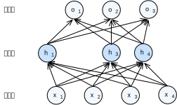

# 丢弃法——从零开始

除了前两节介绍的权重衰减以外，深度学习模型常常使用丢弃法（dropout）来应对过拟合问题。丢弃法有一些不同的变体。本节中提到的丢弃法特指倒置丢弃法（inverted dropout）。它被广泛使用于深度学习。


## 方法和原理

为了确保测试模型的确定性，丢弃法的使用只发生在训练模型时，并非测试模型时。当神经网络中的某一层使用丢弃法时，该层的神经元将有一定概率被丢弃掉。设丢弃概率为$p$。具体来说，该层任一神经元在应用激活函数后，有$p$的概率自乘0，有$1-p$的概率自除以$1-p$做拉伸。丢弃概率是丢弃法的超参数。

我们在[“多层神经网络”](multi-layer.md)一节的图3.3中描述了一个未使用丢弃法的多层感知机。假设其中隐藏单元$h_i$（$i=1, \ldots, 5$）的计算表达式为

$$h_i = \phi(x_1 w_1^{(i)} + x_2 w_2^{(i)} + x_3 w_3^{(i)} + x_4 w_4^{(i)} + b^{(i)}),$$

其中$\phi$是激活函数，$x_1, \ldots, x_4$是输入，$w_1^{(i)}, \ldots, w_4^{(i)}$是权重参数，$b^{(i)}$是偏差参数。设丢弃概率为$p$，并设随机变量$\xi_i$有$p$概率为0，有$1-p$概率为1。那么，使用丢弃法的隐藏单元$h_i$的计算表达式变为

$$h_i = \frac{\xi_i}{1-p} \phi(x_1 w_1^{(i)} + x_2 w_2^{(i)} + x_3 w_3^{(i)} + x_4 w_4^{(i)} + b^{(i)}).$$

注意到测试模型时不使用丢弃法。由于$\mathbb{E} (\xi_i) = 1-p$，同一神经元在模型训练和测试时的输出值的期望不变。

让我们对图3.3中的隐藏层使用丢弃法，一种可能的结果如图3.5所示。



以图3.5为例，每次训练迭代时，隐藏层中每个神经元都有可能被丢弃，即$h_i$（$i=1, \ldots, 5$）都有可能为0。因此，输出层每个单元的计算，例如$o_1 = \phi(h_1 w_1^\prime + h_2 w_2^\prime + h_3 w_3^\prime + h_4 w_4^\prime + h_5 w_5^\prime  + b^\prime)$，都无法过分依赖$h_1, \ldots, h_5$中的任一个。这样通常会造成$o_1$表达式中的权重参数$w_1^\prime, \ldots ,w_5^\prime$都接近0。因此，丢弃法可以起到正则化的作用，并可以用来应对过拟合。

## 实现丢弃法

根据丢弃法的定义，我们可以很容易地实现丢弃法。下面的`dropout`函数将以`drop_prob`的概率丢弃NDArray输入`X`中的元素。

```{.python .input}
import sys
sys.path.append('..')
import gluonbook as gb
from mxnet import autograd, gluon, nd
from mxnet.gluon import loss as gloss

def dropout(X, drop_prob):
    assert 0 <= drop_prob <= 1
    keep_prob = 1 - drop_prob
    # 这种情况下把全部元素都丢弃。
    if keep_prob == 0:
        return X.zeros_like()
    mask = nd.random.uniform(0, 1, X.shape) < keep_prob
    return mask * X / keep_prob
```

我们运行几个例子来验证一下`dropout`函数。

```{.python .input}
X = nd.arange(20).reshape((5, 4))
dropout(X, 0)
```

```{.python .input}
dropout(X, 0.5)
```

```{.python .input}
dropout(X, 1)
```

## 定义模型参数

实验中，我们依然使用[“Softmax回归——从零开始”](softmax-regression-scratch.md)一节中介绍的Fashion-MNIST数据集。我们将定义一个包含两个隐藏层的多层感知机。其中两个隐藏层的输出个数都是256。

```{.python .input  n=2}
num_inputs = 784
num_outputs = 10
num_hiddens1 = 256
num_hiddens2 = 256

W1 = nd.random.normal(scale=0.01, shape=(num_inputs, num_hiddens1))
b1 = nd.zeros(num_hiddens1)
W2 = nd.random.normal(scale=0.01, shape=(num_hiddens1, num_hiddens2))
b2 = nd.zeros(num_hiddens2)
W3 = nd.random.normal(scale=0.01, shape=(num_hiddens2, num_outputs))
b3 = nd.zeros(num_outputs)

params = [W1, b1, W2, b2, W3, b3]
for param in params:
    param.attach_grad()
```

## 定义模型

我们的模型就是将全连接层和激活函数ReLU串起来，并对激活函数的输出使用丢弃法。我们可以分别设置各个层的丢弃概率。通常，建议把靠近输入层的丢弃概率设的小一点。在这个实验中，我们把第一个隐藏层的丢弃概率设为0.2，把第二个隐藏层的丢弃概率设为0.5。我们只需在训练模型时使用丢弃法。

```{.python .input  n=4}
drop_prob1 = 0.2
drop_prob2 = 0.5

def net(X):
    X = X.reshape((-1, num_inputs))
    H1 = (nd.dot(X, W1) + b1).relu()
    # 只在训练模型时使用丢弃法。
    if autograd.is_training():
        # 在第一层全连接后添加丢弃层。
        H1 = dropout(H1, drop_prob1)
    H2 = (nd.dot(H1, W2) + b2).relu()
    if autograd.is_training():
        # 在第二层全连接后添加丢弃层。
        H2 = dropout(H2, drop_prob2)
    return nd.dot(H2, W3) + b3
```

## 训练和测试模型

这部分和之前多层感知机的训练与测试类似。

```{.python .input  n=8}
num_epochs = 5
lr = 0.5
batch_size = 256
loss = gloss.SoftmaxCrossEntropyLoss()
train_iter, test_iter = gb.load_data_fashion_mnist(batch_size)
gb.train_cpu(net, train_iter, test_iter, loss, num_epochs, batch_size, params,
             lr)
```

## 小结

* 我们可以通过使用丢弃法应对过拟合。
* 只需在训练模型时使用丢弃法。

## 练习

- 尝试不使用丢弃法，看看这个包含两个隐藏层的多层感知机可以得到什么结果。
- 如果把本节中的两个丢弃概率超参数对调，会有什么结果？

## 扫码直达[讨论区](https://discuss.gluon.ai/t/topic/1278)


